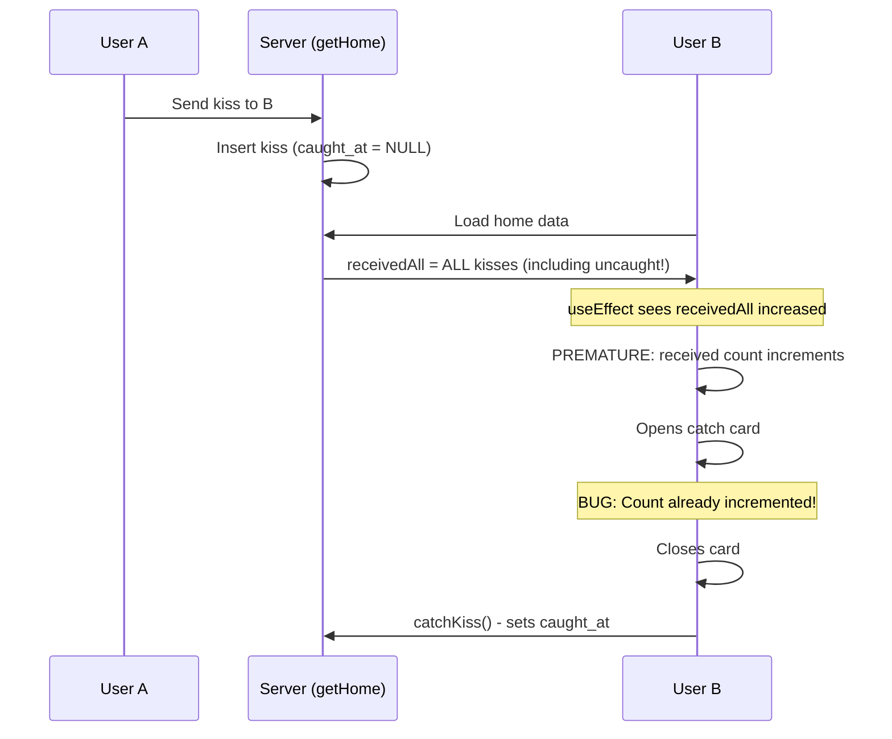
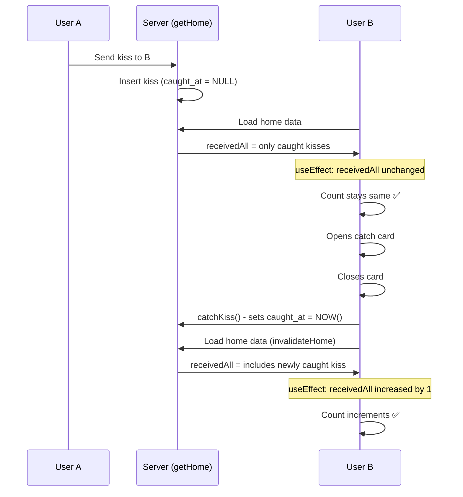

# Catch Timing Fix - Technical Analysis

## The Bug
When a kiss card opened, the `received` count incremented immediately instead of waiting until the user closed the card.

## Root Cause


## The Fix

### Before:
```typescript
// In getHome server function
(select count(*)::int from kisses where to_user_id = ${me}) as received_all
```
This counted **ALL** kisses, even uncaught ones with `caught_at = NULL`.

### After:
```typescript
// In getHome server function
(select count(*)::int from kisses where to_user_id = ${me} and caught_at is not null) as received_all
```
This counts **ONLY** caught kisses where `caught_at is not null`.

## How It Works Now



## Fixed Queries

1. **In-app kisses (kisses table)**:
   ```sql
   select count(*)::int 
   from kisses 
   where to_user_id = ${me} 
     and caught_at is not null  -- ← Added this condition
   ```

2. **Phone kisses (phone_kisses table)**:
   ```sql
   select coalesce(sum(n), 0)::int 
   from phone_kisses 
   where (to_phone = ${phone} or right(to_phone, 8) = ${phone.slice(-8)})
     and caught_at is not null  -- ← Added this condition
   ```

## Impact Analysis

### What Changed:
- ✅ `receivedAll` now only counts caught kisses
- ✅ Local `received` count only updates after user closes card

### What Didn't Change:
- ❌ `receivedToday` still counts all kisses (not used for local state sync)
- ❌ `inbox` array still includes uncaught kisses (needed to show cards)
- ❌ Catch card display logic unchanged
- ❌ `catchKiss`/`catchPhoneKiss` server functions unchanged

## Testing

### Automated Test:
```bash
node test-catch-timing.mjs
```
Result: ✅ Both assertions pass

### Manual Test:
1. User A sends kiss to User B
2. User B sees card open → count stays same ✅
3. User B closes card → count increments ✅
4. Database: caught_at is NULL before close, set after close ✅

## Product Rule Compliance

✅ **"Mark caught only when the user dismisses the catch moment (Close / COME GET IT)"**

The fix ensures:
- Opening the overlay does NOT write `caught_at`
- Opening the overlay does NOT bump `received`
- Only closing the card writes `caught_at` (via `catchKiss`)
- Only after close does `received` increment (via `receivedAll` change)
